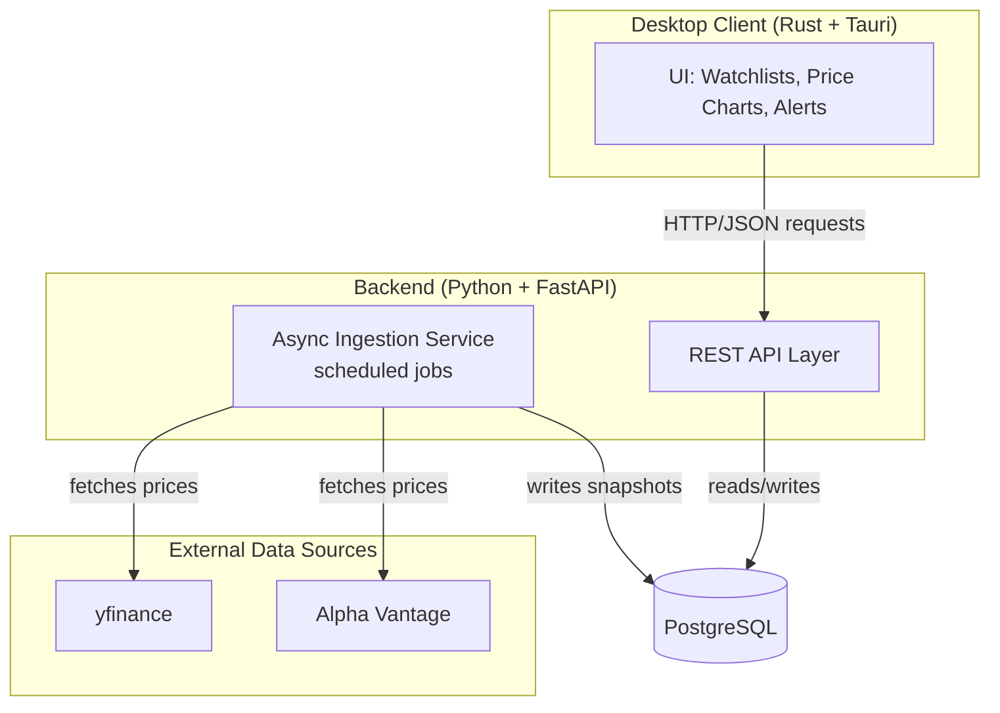
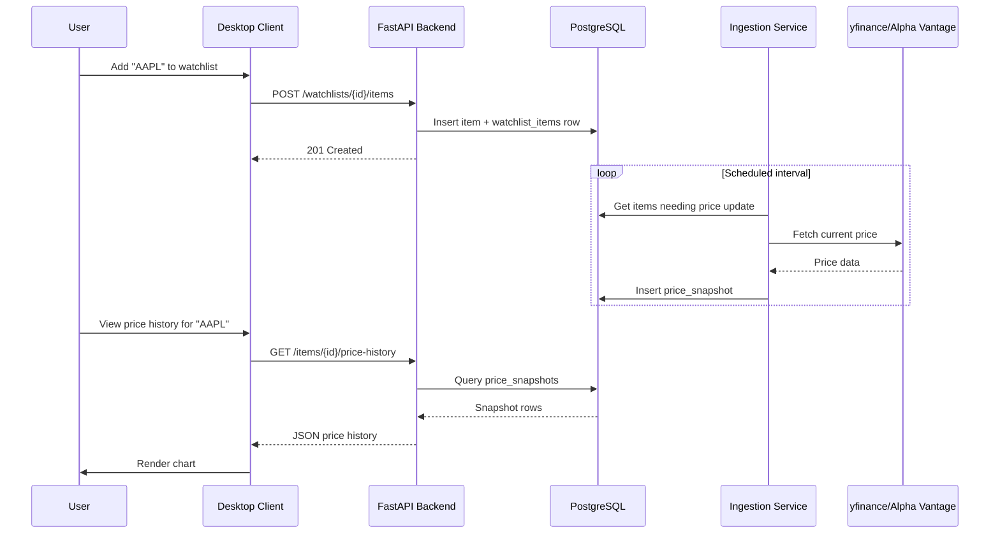

# Architecture

## Overview
A price-tracking system with a Rust + Tauri desktop client, a Python + FastAPI
backend, and an async scraping/ingestion service. The client never touches the
database directly — all access goes through the API.

## System Diagram



## Request Flow Example: Adding a stock and viewing history



## Database Schema

```sql
CREATE TABLE items (
    id INTEGER PRIMARY KEY,
    category TEXT NOT NULL,        -- 'stock', 'mtg_card', etc.
    name TEXT NOT NULL,
    external_id TEXT,              -- ticker symbol, Scryfall ID, etc.
    metadata JSON,
    created_at TIMESTAMP DEFAULT CURRENT_TIMESTAMP
);

CREATE TABLE sources (
    id INTEGER PRIMARY KEY,
    name TEXT NOT NULL,            -- 'yfinance', 'Alpha Vantage', 'TCGPlayer'
    base_url TEXT,
    scrape_config JSON              -- {"method": "api"|"scrape", ...}
);

CREATE TABLE price_snapshots (
    id INTEGER PRIMARY KEY,
    item_id INTEGER REFERENCES items(id),
    source_id INTEGER REFERENCES sources(id),
    price DECIMAL(10,2) NOT NULL,
    currency TEXT DEFAULT 'USD',
    condition TEXT,                 -- card condition; null for stocks
    captured_at TIMESTAMP DEFAULT CURRENT_TIMESTAMP
);

CREATE TABLE users (
    id INTEGER PRIMARY KEY,
    email TEXT UNIQUE NOT NULL,
    created_at TIMESTAMP DEFAULT CURRENT_TIMESTAMP
);

CREATE TABLE watchlists (
    id INTEGER PRIMARY KEY,
    user_id INTEGER REFERENCES users(id),
    name TEXT NOT NULL
);

CREATE TABLE watchlist_items (
    watchlist_id INTEGER REFERENCES watchlists(id),
    item_id INTEGER REFERENCES items(id),
    alert_threshold DECIMAL(10,2),
    PRIMARY KEY (watchlist_id, item_id)
);
```

## Design Decisions

- **`metadata JSON` on items**: avoids rigid per-category columns. Tradeoff:
  harder to index/query inside JSON on some DBs (Postgres JSONB handles this
  reasonably well).
- **Append-only `price_snapshots`**: never update a price, always insert a new
  row. This is what makes the system a tracker, not a lookup tool. Indexed on
  `(item_id, captured_at)` for the main query pattern.
- **`scrape_config` on sources**: keeps ingestion logic data-driven (adapter
  pattern) instead of hardcoded per-site branches. Adding a new source is a
  config entry + small adapter, not new core logic.
- **Client never touches the DB directly**: all access via the API. Keeps the
  desktop client, and any future client (mobile, web), interchangeable.

## Tech Stack

| Layer | Technology |
|---|---|
| Desktop client | Rust + Tauri |
| Backend API | Python + FastAPI |
| Ingestion service | Python (async, `aiohttp`) |
| Database | PostgreSQL |
| Data sources | yfinance, Alpha Vantage |